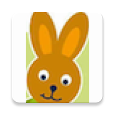
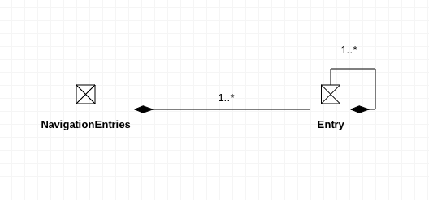
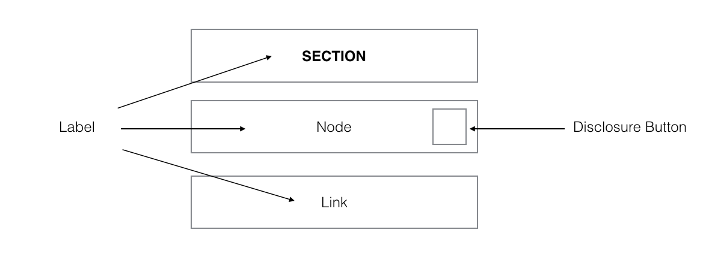

Navigator Demo
======
Show demo how we navigate in Android App generally.

 

### Architecture

- [Model–view–presenter(MVP)](https://en.wikipedia.org/wiki/Model%E2%80%93view%E2%80%93presenter)
- [Dagger2](https://google.github.io/dagger/) 
- [Retrofit2](http://square.github.io/retrofit/) 
- [EventBus](https://github.com/greenrobot/EventBus) 
- [RxAndroid](https://github.com/ReactiveX/RxAndroid) 
- [Data Binding](https://developer.android.com/topic/libraries/data-binding/index.html) 


### Design pattern

- [Bridge](https://en.wikipedia.org/wiki/Bridge_pattern)
- [Composite](https://en.wikipedia.org/wiki/Composite_pattern)
- [Singleton](https://en.wikipedia.org/wiki/Singleton_pattern)
- [Model–view–presenter(MVP)](https://en.wikipedia.org/wiki/Model%E2%80%93view%E2%80%93presenter)

### Other libraries and dependencies

- [GSON](https://github.com/google/gson) as data-parse.
- [Custom Tabs](https://developer.chrome.com/multidevice/android/customtabs) for external-link.
- [smoothprogressbar](https://github.com/castorflex/SmoothProgressBar) as better loading-indicator.
- [Android Support-lib](https://developer.android.com/topic/libraries/support-library/index.html) as you know.

### Testing

[JUnit + Espresso](https://developer.android.com/training/testing/ui-testing/espresso-testing.html)

In order to improve testing performance of business-logical we mock internet remove feeds, see ```MockService``` .

### Data Structure

There are only 2 types to represent how navigation-data will be generated, the ```Entry``` and ```NavigationEntries``` which is aggregated by ```Entry```.

```Entry``` can also be aggregated by itself.



Also you get that there are four ```Entry``` types:

- node: represented in JSON as "type": "node"
- link: represented in JSON as "type": "link"
- section: represented in JSON as"type": "section"
- external-link: represented in JSON as "type": "external-link"

Here we use different layouts to represent them.

```ìtem-section.xml``` ```ìtem-node.xml``` ```ìtem-link.xml``` (also for external-link)

 


### Mocked feeds

```json
{
	"navigationEntries": [{
		"type": "section",
		"label": "Sortiment",
		"children": [{
			"type": "node",
			"label": "Alter",
			"children": [{
				"type": "node",
				"label": "Baby & Kleinkind",
				"children": [{
					"type": "link",
					"label": "0-6 Monate",
					"url": "http:\/\/www.mytoys.de\/0-6-months\/"
				}, {
					"type": "external-link",
					"label": "7-12 Monate",
					"url": "http:\/\/www.mytoys.de\/7-12-months\/"
				}]
			}]
		}]
	}]
}
```

### Version

[v0.1](https://github.com/XinyueZ/NavigatorDemo/releases/tag/v0.1_a_a)
> The app has menu now, some UITests have been added, the architecture added , etc.

After v0.1 there's a new branch [dev](https://github.com/XinyueZ/NavigatorDemo/tree/dev) for more developments.

v0.2
> Bug-fix, more test-cases and tools.
- Payload external-link by custom-tabs not "link".
- Added a common method ```rebuildForSections``` to rebuild entry-list if it's children have sections. A section gives our children entries, the method makes children as siblings of sections on the same UI-level. 
- Fix indicator for selected link.

### LICENSE

> MIT License
 ```
  Copyright (c) 2017 Chris Xinyue Zhao
  
  Permission is hereby granted, free of charge, to any person obtaining a copy
  of this software and associated documentation files (the "Software"), to deal
  in the Software without restriction, including without limitation the rights
  to use, copy, modify, merge, publish, distribute, sublicense, and/or sell
  copies of the Software, and to permit persons to whom the Software is
  furnished to do so, subject to the following conditions:
  
  The above copyright notice and this permission notice shall be included in all
  copies or substantial portions of the Software.
  
  THE SOFTWARE IS PROVIDED "AS IS", WITHOUT WARRANTY OF ANY KIND, EXPRESS OR
  IMPLIED, INCLUDING BUT NOT LIMITED TO THE WARRANTIES OF MERCHANTABILITY,
  FITNESS FOR A PARTICULAR PURPOSE AND NONINFRINGEMENT. IN NO EVENT SHALL THE
  AUTHORS OR COPYRIGHT HOLDERS BE LIABLE FOR ANY CLAIM, DAMAGES OR OTHER
  LIABILITY, WHETHER IN AN ACTION OF CONTRACT, TORT OR OTHERWISE, ARISING FROM,
  OUT OF OR IN CONNECTION WITH THE SOFTWARE OR THE USE OR OTHER DEALINGS IN THE
  SOFTWARE.
  ```

